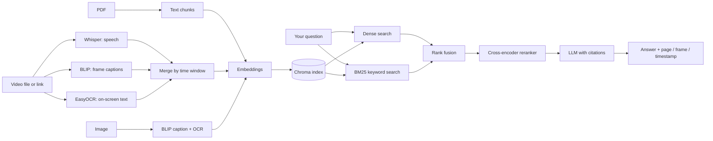

# 🔎 SourceLens

> Ask your **PDFs, videos and images** anything. SourceLens answers in plain language and shows its evidence: the **page**, the **video frame** and the **timestamp** each claim came from. If the answer isn't in your files, it says *"Not found"* instead of guessing.

[demo][demo-link](https://lnkd.in/p/evwJE_7i)


*"Why does the professor ask the class why nobody protested?"* → a cited answer, the matching video frames, and a link that jumps to the right second.

---

## Features

- **One library for every format**: PDFs, video files, video links (YouTube, Facebook, Instagram) and images.
- **Videos are fully understood**: Whisper transcribes the speech, BLIP describes the frames, and EasyOCR reads text shown on screen. Everything is merged by time, so a question can match what was *said* and what was *shown*.
- **Hybrid search + reranking**: meaning-based search and keyword search run together, then a cross-encoder picks the best passages.
- **Answers with receipts**: every claim carries a citation like `[lecture.mp4 01:20]` or `[guide.pdf p.12]`, and the UI shows the source page or frame.
- **Honest refusals**: when the sources don't contain the answer, it replies "Not found in the sources."
- **Scoped search**: limit a question to one or more files, so "what is the main topic?" means *this* video.
- **Library management**: add, remove and re-add sources from the UI; recent questions can be reused or deleted.
- **Measured, not guessed**: built-in evaluation scripts (hit@k, MRR, ablations, answer faithfulness) with every experiment saved in `eval/`.

## Architecture



Every source becomes small text passages with the same record format (`source`, `page or second`, `type`, `text`), so retrieval doesn't care whether a passage came from a PDF or a video.

## How each source is processed

| Source | What happens |
|---|---|
| **PDF** | Text is split into overlapping chunks of about 200 words, stored with the page number. |
| **Video** | Audio goes to Whisper (speech in ~30 s chunks). Frames are sampled when the scene changes, described by BLIP and read by OCR. Descriptions and on-screen text are merged into the matching speech chunk; new on-screen text gets its own short record. Videos with almost no speech (music) keep their frame records. |
| **Image** | The EXIF rotation is applied, then BLIP writes a caption and OCR reads any text. |
| **Video link** | `yt-dlp` downloads the video (up to 10 minutes), then it is processed like a file. The link is kept so citations can jump to the timestamp. |

## Results

Measured on **36 hand-written questions** over **9 sources** (2 PDFs, 6 videos, 1 image), `k = 6`. *hit@6*: a correct source is in the top 6. *MRR*: how close to the top the first correct source is (1.00 = always first).

| Retrieval setup | hit@6 | MRR |
|---|---|---|
| Dense embeddings only | 0.97 | 0.74 |
| BM25 keywords only | 0.86 | 0.69 |
| Hybrid (dense + BM25) | 0.89 | 0.78 |
| Dense + reranker | 0.97 | 0.90 |
| **Hybrid + reranker (default)** | **1.00** | **0.91** |

## Tech stack

Python · Whisper (via Groq) · BLIP · EasyOCR · Sentence-Transformers (`bge-small-en`) · cross-encoder reranker (`ms-marco-MiniLM`) · BM25 · ChromaDB · Groq LLM (`openai/gpt-oss-120b`) · yt-dlp · PyMuPDF · OpenCV · Gradio · Docker

## Project structure

```
├── app.py            # Gradio UI (dark blue and yellow theme)
├── main.py           # command line: ingest / ask
├── pipeline.py       # ingest or remove one source
├── ingest_pdf.py  ingest_video.py  ingest_audio.py  ingest_image.py  ingest_url.py
├── ocr.py            # EasyOCR helper
├── merge.py          # folds frames and on-screen text into speech chunks
├── store.py          # Chroma index
├── retrieval.py      # dense + BM25 + rank fusion + reranker
├── query.py          # prompt, LLM call, citations
├── config.py         # settings (override with environment variables)
├── eval.py  answer_eval.py        # retrieval and answer evaluation
├── show.py  sources.py  debug.py  # helpers to inspect the index
├── eval/             # question set and the saved result of every experiment
├── data/  store/     # your files and the search index (git-ignored)
├── Dockerfile  docker-compose.yml
└── requirements.txt  .env.example
```

## Getting started

You need a free [Groq](https://console.groq.com) API key.

```bash
git clone https://github.com/<your-username>/sourcelens.git
cd sourcelens

python -m venv .venv
.venv\Scripts\activate          # Windows  (source .venv/bin/activate on macOS/Linux)
pip install -r requirements.txt

# add your key
cp .env.example .env            # then edit .env and paste your key

python app.py
```

Open <http://127.0.0.1:7860>. The first question downloads the models. Add files with **Add to library**, then ask.


## 🐳 Run with Docker

### Build the image

```bash
docker build -t sourcelens .
```

### Configure environment variables

Create a `.env` file containing your credentials:

```
GROQ_API_KEY=your_groq_api_key
LLM_MODEL=openai/gpt-oss-120b
WHISPER_MODEL=whisper-large-v3-turbo
```

Do not commit `.env` or expose API keys in the repository.

### Run the container

```bash
docker compose up --build
```

Open <http://localhost:7860>. The `data/` and `store/` folders are mounted into the container, so your files and the index survive restarts. The first build downloads PyTorch (CPU build) and takes a while.

## Configuration

| Variable | Default | Purpose |
|---|---|---|
| `GROQ_API_KEY` | none | Groq API key (required) |
| `LLM_MODEL` | `openai/gpt-oss-120b` | Model that writes the answers |
| `WHISPER_MODEL` | `whisper-large-v3-turbo` | Speech-to-text model |
| `OCR_LANGS` | `en` | OCR languages, e.g. `en,ar` for Arabic |
| `MERGE_FRAMES` | `1` | Fold frame descriptions into speech chunks |
| `SCREEN_RECORDS` | `1` | Store on-screen text as its own record |
| `OCR_CORNERS` | `0` | Extra OCR pass on the image corners (slower) |

## Evaluation

```bash
python eval.py            # retrieval: hit@6, MRR, ablations, latency  → eval/results.md
python answer_eval.py 3   # answers: cited? supported? refused when it should? (every 3rd question)
```

`eval/questions.json` holds the 36 questions. They refer to my own files in `data/`, which aren't included, so the set can't be re-run as-is, but the format is simple to copy for your own documents. The results of every experiment are saved in `eval/`.

